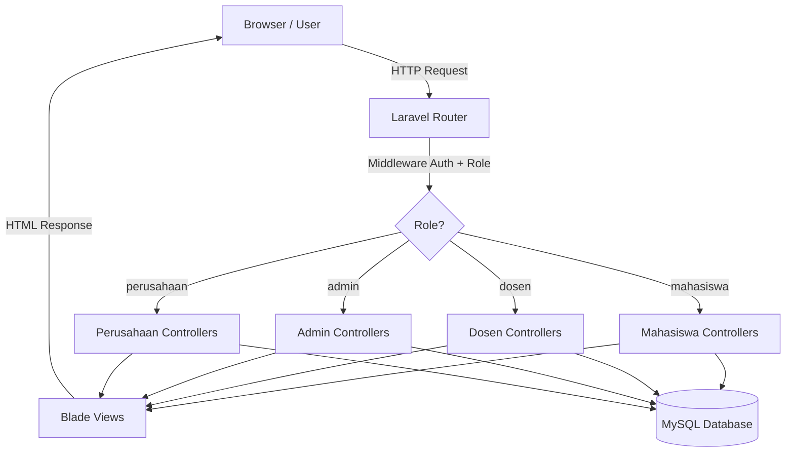
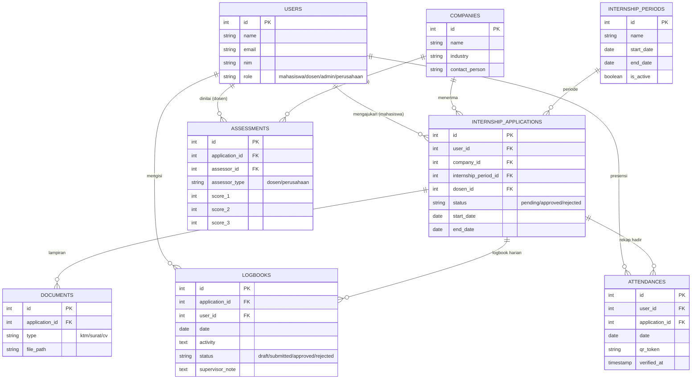
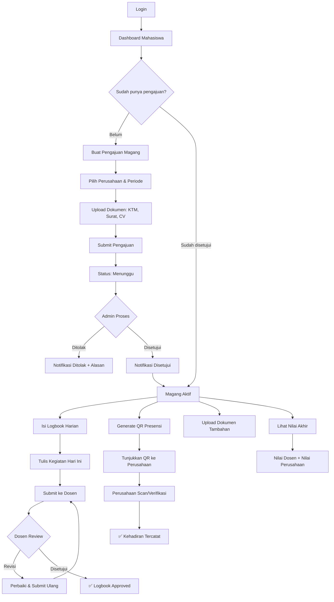
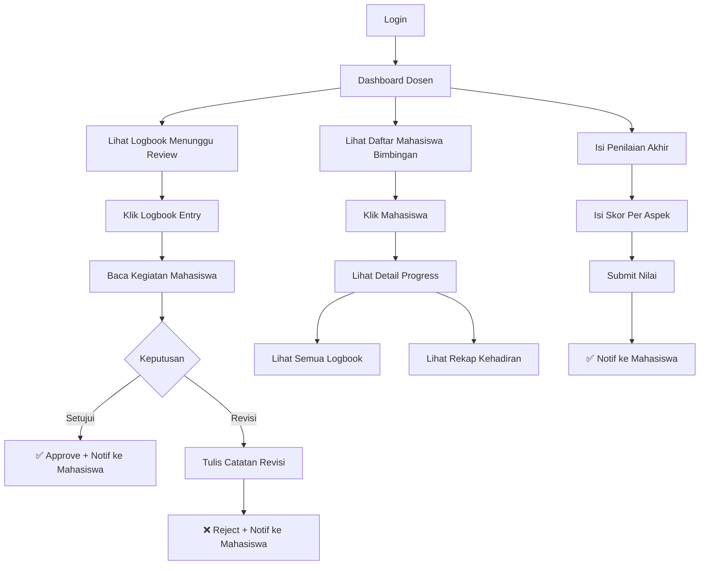
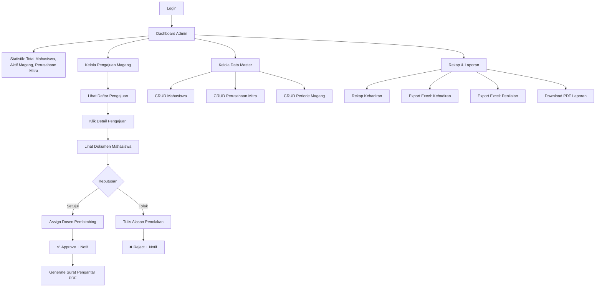
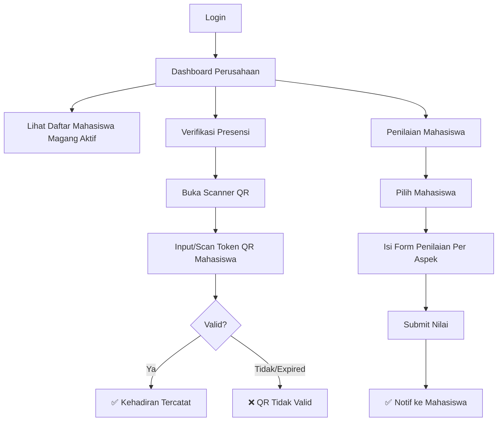
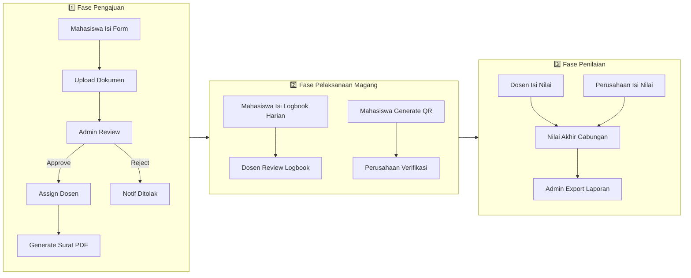

# Penjelasan Flow Aplikasi SiMagang
> **Sistem Informasi Magang Mahasiswa**  
> Dibuat untuk presentasi ke Dosen Pembimbing

---

## 1. Gambaran Umum Sistem

SiMagang adalah **sistem informasi berbasis web** yang mengelola **seluruh siklus magang mahasiswa** — dari pengajuan hingga penilaian akhir. Sistem ini menggantikan proses manual (surat fisik, logbook kertas, koordinasi via WhatsApp) menjadi digital dan terpusat.

### Masalah yang Diselesaikan
- ❌ Administrasi magang masih **manual** (surat fisik, logbook kertas)
- ❌ **Tidak ada transparansi** status pengajuan bagi mahasiswa
- ❌ Dosen **kewalahan** memantau banyak mahasiswa tanpa dashboard terpusat
- ❌ Perusahaan tidak punya cara mudah untuk **verifikasi kehadiran**

### Solusi SiMagang
- ✅ Semua proses **digital** dan terintegrasi dalam satu platform
- ✅ **4 role** dengan dashboard dan akses berbeda
- ✅ **Notifikasi otomatis** via in-app dan email
- ✅ **QR Code** untuk presensi harian
- ✅ **Export** laporan ke Excel dan PDF

---

## 2. Arsitektur Sistem



### Tech Stack

| Komponen | Teknologi |
|---|---|
| **Framework** | Laravel 13 (PHP 8.3) |
| **Database** | MySQL |
| **Frontend** | Blade Template + Tailwind CSS v4 |
| **Autentikasi** | Laravel Auth + Spatie Permission (multi-role) |
| **PDF Generator** | DomPDF (surat pengantar + sertifikat) |
| **Excel Export** | Maatwebsite Excel |
| **QR Code** | SimpleSoftwareIO QR Code |
| **Email** | Gmail SMTP |
| **Hosting** | Railway (Docker-based) |

---

## 3. Database Schema (Entity Relationship)



---

## 4. Flow Per Role

### 4.1 Flow Mahasiswa



**Penjelasan detail:**

1. **Login** → Mahasiswa login dengan email & password
2. **Dashboard** → Melihat ringkasan: status pengajuan, progress logbook, persentase kehadiran, nilai
3. **Pengajuan Magang** → Mengisi form (pilih perusahaan, periode, tulis motivasi) lalu upload 3 dokumen (KTM, surat permohonan, CV)
4. **Menunggu Persetujuan** → Admin akan review dan menyetujui/menolak
5. **Jika Disetujui** → Mahasiswa bisa mulai:
   - **Isi Logbook Harian**: Catat kegiatan setiap hari, submit ke dosen untuk review
   - **QR Presensi**: Generate QR code unik setiap hari, ditunjukkan ke perusahaan untuk verifikasi kehadiran
   - **Upload Dokumen**: Upload dokumen tambahan yang diperlukan
6. **Nilai Akhir** → Lihat nilai gabungan dari dosen pembimbing dan perusahaan

---

## 4.2 Flow Dosen Pembimbing



**Penjelasan detail:**

1. **Dashboard** → Melihat ringkasan: jumlah mahasiswa bimbingan, logbook yang menunggu review
2. **Review Logbook** → Membaca kegiatan harian mahasiswa, lalu menyetujui atau meminta revisi (dengan catatan)
3. **Monitoring** → Melihat progress keseluruhan setiap mahasiswa bimbingan
4. **Penilaian** → Di akhir periode, mengisi form penilaian per aspek (skor 1-100)

---

## 4.3 Flow Admin Prodi



**Penjelasan detail:**

1. **Dashboard** → Statistik keseluruhan: total mahasiswa, mahasiswa aktif magang, jumlah perusahaan mitra, pengajuan pending
2. **Proses Pengajuan** → Review pengajuan mahasiswa, lihat dokumen lampiran, setujui/tolak, assign dosen pembimbing
3. **Generate Surat PDF** → Otomatis generate surat pengantar magang dalam format PDF
4. **Manajemen Data** → CRUD data mahasiswa, perusahaan mitra, dan periode magang
5. **Laporan** → Rekap kehadiran, export data ke Excel/PDF

---

## 4.4 Flow Perusahaan Mitra



**Penjelasan detail:**

1. **Dashboard** → Melihat daftar mahasiswa yang sedang magang di perusahaan tersebut
2. **Verifikasi Presensi** → Scan/input QR code yang ditunjukkan mahasiswa setiap hari. QR hanya valid untuk hari itu (expired keesokan harinya)
3. **Penilaian** → Di akhir periode magang, mengisi form penilaian dari perspektif industri

---

## 5. Flow Keseluruhan (End-to-End)



### Tiga Fase Utama:

| Fase | Aktor Utama | Aktivitas |
|---|---|---|
| **1. Pengajuan** | Mahasiswa → Admin | Mahasiswa submit form + dokumen, Admin review & approve/reject, Generate surat pengantar |
| **2. Pelaksanaan** | Mahasiswa ↔ Dosen ↔ Perusahaan | Logbook harian (mahasiswa ↔ dosen), Presensi QR (mahasiswa ↔ perusahaan) |
| **3. Penilaian** | Dosen + Perusahaan → Admin | Dosen & perusahaan input nilai, Admin export laporan keseluruhan |

---

## 6. Sistem Notifikasi

| Event | Siapa Dapat Notif | Channel |
|---|---|---|
| Pengajuan di-approve/reject | Mahasiswa | Database + Email |
| Logbook baru di-submit | Dosen Pembimbing | Database + Email |
| Logbook di-review (approve/revisi) | Mahasiswa | Database + Email |
| Penilaian selesai diisi | Mahasiswa | Database + Email |

---

## 7. Sistem Autentikasi & Otorisasi

```mermaid
flowchart TD
    A[User Akses URL] --> B{Sudah Login?}
    B -->|Belum| C[Redirect ke /login]
    B -->|Sudah| D{Cek Role via Middleware}
    D -->|Role cocok| E[Akses Halaman]
    D -->|Role tidak cocok| F[403 Forbidden]
    
    C --> G[Input Email + Password]
    G --> H{Valid?}
    H -->|Ya| I[Redirect ke Dashboard sesuai Role]
    H -->|Tidak| J[Error: Kredensial salah]
    
    I --> K{Role apa?}
    K -->|mahasiswa| L[/mahasiswa/dashboard]
    K -->|dosen| M[/dosen/dashboard]
    K -->|admin| N[/admin/dashboard]
    K -->|perusahaan| O[/perusahaan/dashboard]
```

- **Multi-role** menggunakan package **Spatie Laravel Permission**
- Setiap route group dilindungi **middleware `role:`** sehingga mahasiswa tidak bisa akses halaman admin, dan sebaliknya
- Tersedia fitur **Lupa Password** yang mengirim link reset via email

---

## 8. Deployment

| Aspek | Detail |
|---|---|
| **Live URL** | https://simagang-production.up.railway.app |
| **Hosting** | Railway (Docker-based, auto-deploy) |
| **Database** | MySQL (Railway managed service) |
| **Repository** | https://github.com/ajiarl/simagang |
| **CI/CD** | Push ke branch `main` → auto redeploy |

---

## 9. Ringkasan Fitur (8 Fitur MVP)

| No | Fitur | Deskripsi |
|---|---|---|
| 1 | **Multi-role Auth & Dashboard** | 4 role berbeda (mahasiswa, dosen, admin, perusahaan) dengan dashboard masing-masing |
| 2 | **Pengajuan Magang** | Form pengajuan + upload dokumen, approve/reject oleh admin |
| 3 | **Manajemen Dokumen & Surat** | Generate surat pengantar PDF otomatis, upload KTM/CV/surat |
| 4 | **Logbook Digital Harian** | Catat kegiatan harian, review & catatan dari dosen |
| 5 | **QR Code Presensi** | QR unik per hari, verifikasi oleh perusahaan |
| 6 | **Penilaian Terstruktur** | Nilai dari dosen & perusahaan, skor gabungan otomatis |
| 7 | **Notifikasi In-App & Email** | Notif otomatis untuk setiap perubahan status |
| 8 | **Laporan & Export** | Export data ke Excel (kehadiran, nilai) dan PDF |
